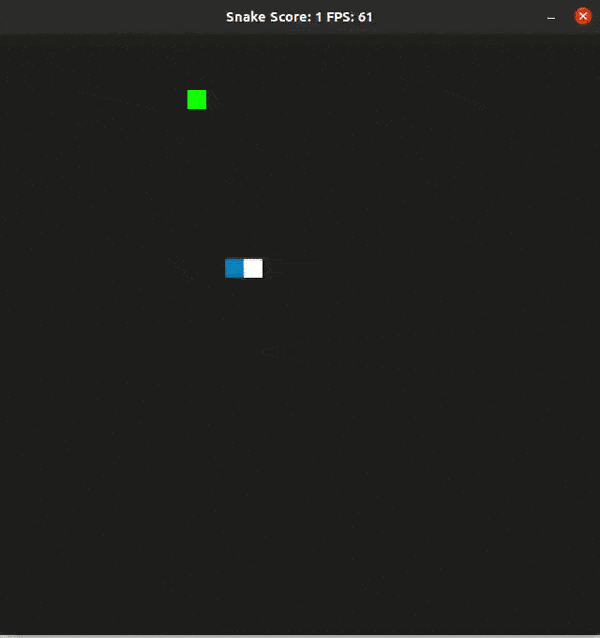

# CPPND: Capstone Snake Game 

This project is my final submission for the Capston project in the  [Udacity C++ Nanodegree Program](https://www.udacity.com/course/c-plus-plus-nanodegree--nd213). The starter code for this Capstone project was inspired by [this](https://codereview.stackexchange.com/questions/212296/snake-game-in-c-with-sdl) excellent StackOverflow post and set of responses.
The project is made up of 5 main classes. The audio class handle the in game audio. The  controller class handles user input for the game play. The game class handle the game play for example placing the food randomly and ensuring a constant frame rate. The renderer class handles the opening of the game window and how objects are displayed within the window. Finally, the snake class handles the snake object; for example its growth, speed, its movement etc.

## Modifications
A few improvements were made to the started code. In the files these additions have comments beginning with "New" attached to them.
* The speed was made constant and poisoned food feature was added to the game. The game begins with the normal food and poisoned food is added anytime the score reaches a  multiple of 5. The snake still grows when it eats normal food but dies on consumption of the poisoned food
* The colour of the normal food was changed from yellow to green. The poisoned food colour was set to red.
* Sound was added to the game. When the snake eats the food a crunching sound is played and when the snake dies a game over sound is played.
* The game was modified to restart on the death of the snake. The snakes length, the score, the snake body and the poisoned food are all resest. The user can continue playing the game until they close the window.

## Ruberic Points Addressed
The following rubric points were addressed in this project.   
* The project demonstrates an understanding of C++ functions and control structures.
  * In game.cpp line 79 a PoisonedFood() method is implemented with if clauses, for loops and a while loop.   
* The project reads data from a file and process the data, or the program writes data to a file.
  * In audio.cpp line 33 the LoadSound() method accesses sound files in the work space.
* The project uses Object Oriented Programming techniques.
  * A new class Sound has been defined and implemented in audio.h and audio.cpp files
* Classes use appropriate access specifiers for class members.
  * In the audio.h the member have been defined as either public or private
* Class constructors utilize member initialization lists.
  * In the audio.cpp file line 9 the member _numChannels has been initialised with an initialisation list. Also in game.cpp line 8 the new sound member is initialised in the initialisation list.

## Future Work
* Adding game menu title page etc.
* Adding different game difficulties and set the snake speed accordingly.
* Adding in game music.
* Rending the in game objects with more realistic objects.

## Dependencies for Running Locally
* cmake >= 3.7
  * All OSes: [click here for installation instructions](https://cmake.org/install/)
* make >= 4.1 (Linux, Mac), 3.81 (Windows)
  * Linux: make is installed by default on most Linux distros
  * Mac: [install Xcode command line tools to get make](https://developer.apple.com/xcode/features/)
  * Windows: [Click here for installation instructions](http://gnuwin32.sourceforge.net/packages/make.htm)
* SDL2 >= 2.0
  * All installation instructions can be found [here](https://wiki.libsdl.org/Installation)
  * Note that for Linux, an `apt` or `apt-get` installation is preferred to building from source.
* gcc/g++ >= 5.4
  * Linux: gcc / g++ is installed by default on most Linux distros
  * Mac: same deal as make - [install Xcode command line tools](https://developer.apple.com/xcode/features/)
  * Windows: recommend using [MinGW](http://www.mingw.org/)

## Basic Build Instructions

1. Clone this repo.
2. Make a build directory in the top level directory: `mkdir build && cd build`
3. Compile: `cmake .. && make`
4. Run it: `./SnakeGame`.